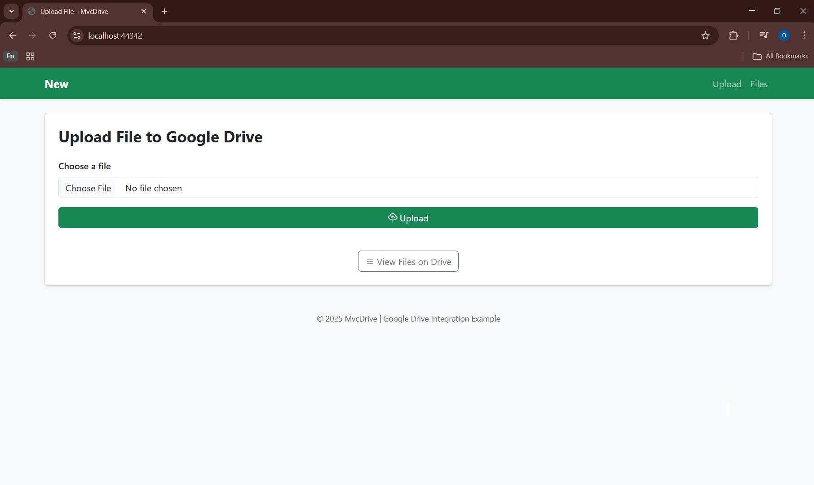
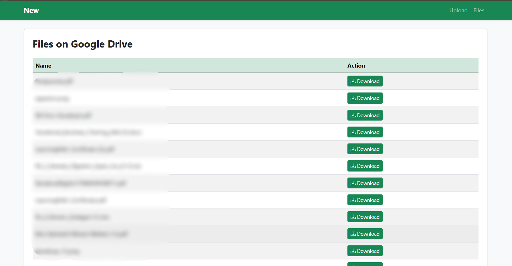
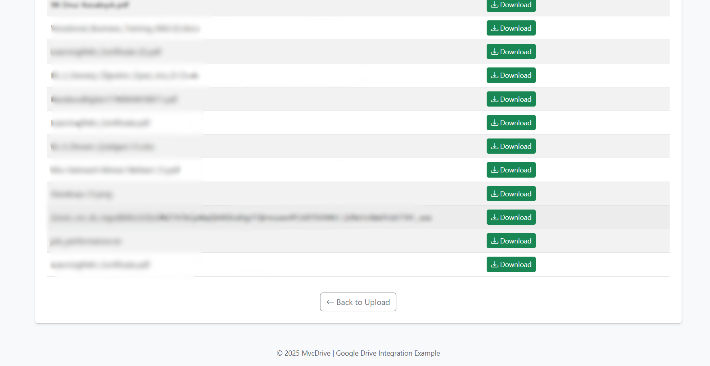

# Google Drive File Manager

This project is a web application that connects to your personal Google Drive account, allowing you to easily manage your files through your browser.

## 📱 Screenshots and Descriptions

### 🏠 Main Page

**Choose File** - Select files from your computer: photos, documents, videos - you can select any type of file

**List Files** - View all files in your Google Drive: list your files just like logging into Drive

**Upload** - Upload selected files to your Google Drive: file transfer happens through Google's secure servers

### 📋 File List Page 1

**Download** - Download files to your computer: quick and easy one-click download

**File Information** - View all file names and upload dates

### 📂 File List Page 2

**Delete** - Delete unwanted files from Google Drive: get rid of unnecessary files

**Back to Upload** - Return to main page: easily go back to upload new files

## 🚀 Features
- Secure connection to Google Drive
- Upload any file type
- Download files directly to your computer
- View file information and upload dates
- Delete files from Google Drive
- User-friendly interface

## 💻 Technologies Used
- ASP.NET MVC
- Google Drive API
- OAuth 2.0 Authentication
- C#
- HTML/CSS/JavaScript

## 🔒 Security
All file transfers are handled through Google's secure servers. Your credentials are protected with OAuth 2.0 authentication protocol.
